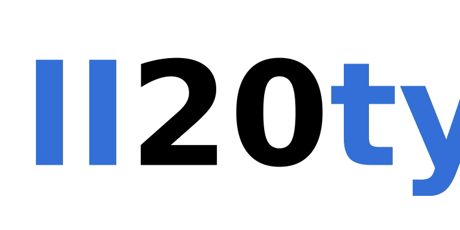

    

## Overview

20ty is an app designed to simplify following the 20-20-20 rule
in your daily work rhythm.

## License

Copyright © 2022  Franchesko Korako

This program is free software: you can redistribute it and/or modify it
under the terms of the GNU General Public License as published by the Free Software Foundation,
either version 3 of the License, or (at your option) any later version.

This program is distributed in the hope that it will be useful, but WITHOUT ANY WARRANTY;
without even the implied warranty of MERCHANTABILITY or FITNESS FOR A PARTICULAR PURPOSE.
See the GNU General Public License for more details.

You should have received a copy of the GNU General Public License along with this program.
If not, see <https://www.gnu.org/licenses/>. 

## Logo & Branding

Copyright © 2022 Franchesko Korako. All Rights Reserved.
